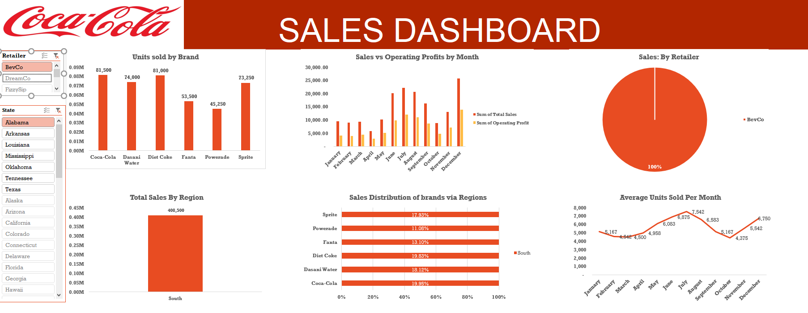

# 🥤 Coca-Cola Sales Dashboard (Excel)

## Project Overview
This project analyzes beverage sales performance using Microsoft Excel.  
The dashboard focuses on understanding product performance, regional sales trends, retailer contributions, and monthly profitability.

The analysis provides insights into how different Coca-Cola beverage brands perform across regions and retailers.

---

# Dataset
The dataset includes sales records for multiple Coca-Cola beverage brands across the United States.

Key data fields include:

- Beverage Brand
- Retailer
- State
- Region
- Monthly Sales
- Units Sold
- Operating Profit

The data was cleaned and transformed in Excel before creating the dashboard.

---

# Dashboard Features

## Units Sold by Brand
A comparison of total units sold for each beverage brand:

- Coca-Cola
- Dasani Water
- Diet Coke
- Fanta
- Powerade
- Sprite

This helps identify the most popular beverage products.

---

## Sales vs Operating Profit
A monthly comparison between total sales and operating profit to evaluate profitability trends throughout the year.

---

## Sales by Retailer
A breakdown of how much each retailer contributes to total beverage sales.

Retailers analyzed include:

- BevCo
- DreamCo
- FizzySip
- Sodapop

---

## Total Sales by Region
Regional sales performance across:

- Midwest
- Northeast
- South
- Southeast
- West

This allows geographic comparison of sales performance.

---

## Sales Distribution by Brand and Region
This visualization shows how different beverage brands perform in each region.

---

## Average Units Sold per Month
A monthly trend analysis showing how product demand changes over the year.

---

# Key Insights

- Coca-Cola and Diet Coke have the highest number of units sold.
- Sales and operating profit increase during mid-year and end-of-year months.
- The West region generates the highest overall sales.
- Retailer contributions vary significantly, with some retailers driving the majority of sales.

---

# Tools Used

- Microsoft Excel
- Pivot Tables
- Data Cleaning
- Interactive Filters (Slicers)
- Data Visualization

---

# Dashboard Preview

---

# Skills Demonstrated

- Sales Data Analysis
- Regional Performance Analysis
- Retailer Sales Analysis
- Excel Dashboard Design
- Data Visualization
